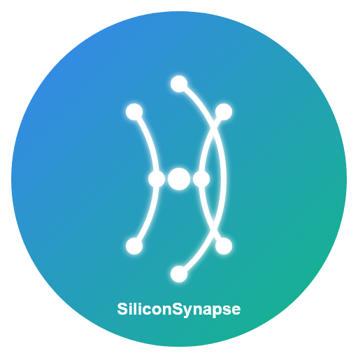

# Silicon Synapse

A modern React-based web application for AI and technology services. Silicon Synapse showcases various AI agent services, technology orbit, and interactive components with a sleek user interface.



## 🚀 Features

- **AI Agent Services** - Showcase of various AI-powered solutions and services
- **Technology Orbit** - Interactive display of technology stack and capabilities
- **User Authentication** - Firebase-based authentication system
- **Interactive Chatbot** - AI-powered chatbot for user assistance
- **Dynamic Content** - Content that adapts based on user interaction
- **Responsive Design** - Fully responsive layout for all device sizes

## 🔧 Tech Stack

- **Frontend**: React.js with React Router
- **Styling**: Custom CSS with responsive design
- **Authentication**: Firebase Authentication
- **API**: RESTful API for chatbot and other services
- **Build Tool**: Vite
- **Deployment**: Compatible with various hosting platforms

## 🛠️ Installation

1. Clone the repository:
   ```bash
   git clone https://github.com/yourusername/siliconsynapse.git
   cd siliconsynapse
   ```

2. Install dependencies:
   ```bash
   npm install
   ```

3. Configure Firebase:
   - Create a Firebase project at [Firebase Console](https://console.firebase.google.com/)
   - Enable Authentication services
   - Update the Firebase configuration in `src/firebase.js`

4. Start the development server:
   ```bash
   npm run dev
   ```

5. For production build:
   ```bash
   npm run build
   ```

## 📁 Project Structure

- `src/components/` - React components for the application
- `src/assets/` - Static assets including images and icons
- `src/services/` - API services and mock server
- `src/App.jsx` - Main application component
- `src/App.css` - Main application styles
- `src/firebase.js` - Firebase configuration and services
- `docs/` - Documentation files

## 🧩 Components

- **Navbar** - Navigation and authentication state
- **Hero** - Main hero section with eye-catching design
- **AIAgentServices** - Display of AI agent service offerings
- **TechOrbit** - Technology stack visualization
- **DynamicContent** - Content that changes based on user interaction
- **Chatbot** - Interactive customer support chatbot with API integration
- **Login** - User authentication interface

## 🔐 Authentication

The application uses Firebase Authentication for user management. To enable:

1. Set up Firebase project and enable authentication methods (Google, Email/Password, etc.)
2. Update the Firebase configuration in `src/firebase.js`
3. The login component is pre-configured to work with Firebase Authentication

## 🎨 Customization

- **Theme**: Update colors and styling in `src/silicon-synapse-theme.css`
- **Content**: Modify component content in respective component files
- **Services**: Add or update services in `src/components/AIAgentServices.jsx`
- **Technologies**: Update technology orbit in `src/components/TechOrbit.jsx`

## 📝 License

[MIT License](LICENSE)

## 👨‍💻 Author

Your Name

---

*Made with ❤️ by Siliconsynapse Team*